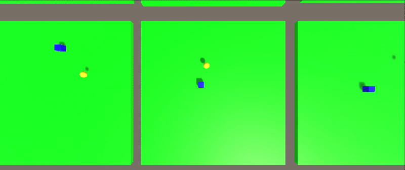
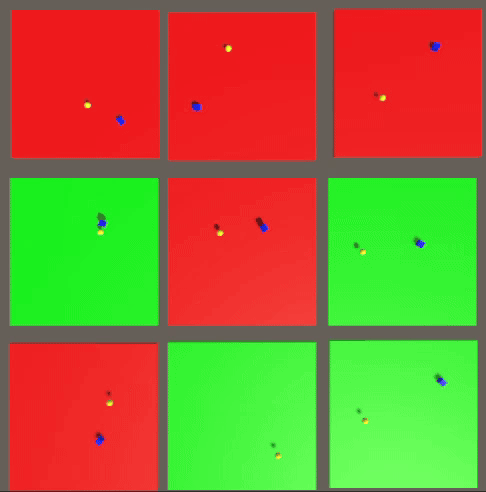
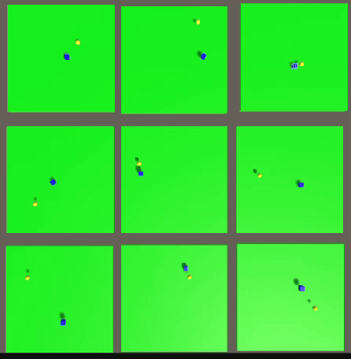

# 🤖🎮 Unity AI Learning to Move with PPO Reinforcement Learning

  
  

  

## 📝 Project Description
This project demonstrates **Reinforcement Learning** using **PPO (Proximal Policy Optimization)** in **Unity 3D** to train an AI agent to navigate and reach a target.  
The blue cube learns to move towards the yellow sphere (reward) through trial and error across multiple parallel training environments.

⚡️ Essentially, the AI learns navigation skills autonomously by being rewarded for reaching its goal!

---

## ⚙️ Features

🧠 **PPO Reinforcement Learning** - State-of-the-art algorithm for training intelligent agents.  

🎮 **Unity ML-Agents** - Unity's machine learning framework for 3D environments.  

🔄 **Parallel Training** - Multiple platforms train simultaneously to speed up learning.  

📊 **Visual Feedback** - Green platforms indicate successful goal reach within time limit, red indicates failure.  

🎯 **Simple Goal** - Blue cube agent learns to reach yellow sphere reward.

---

## Example Outputs

---

## 🧠 Training Visualization

The training process shows multiple parallel environments:
- **Blue cubes** = AI agents learning to navigate  
- **Yellow spheres** = Target rewards to reach  
- **Green platforms** = Successful episodes (goal reached in time)  
- **Red platforms** = Failed episodes (timeout before reaching goal)

<!--
Training in action:

Advanced training stage:

-->

---

## ⚙️ How it Works

1. 🎬 **Environment Reset** → Each platform initializes with random agent and target positions.  
2. 🤖 **Observation** → The agent observes its position, target position, and distance.  
3. 🧠 **Decision** → PPO algorithm decides movement actions based on current policy.  
4. 🎯 **Action & Reward** → Agent moves and receives rewards for getting closer or reaching the goal.  
5. 🔄 **Learning** → Neural network updates based on accumulated experiences across all platforms.  
6. ✅ **Success Indicator** → Platform turns green on success, red on timeout.

The parallel training approach significantly accelerates the learning process by gathering experiences from multiple agents simultaneously.

---

## 🧰 Components

| Component | Description |
|-----------|-------------|
| 🎮 **Training Platform** | Multiple parallel environments for simultaneous learning |
| 🤖 **Agent (Blue Cube)** | AI-controlled entity learning navigation |
| 🎯 **Goal (Yellow Sphere)** | Target reward the agent must reach |
| 🧠 **PPO Algorithm** | Reinforcement learning algorithm optimizing agent behavior |
| 📊 **Visual Feedback** | Color-coded platforms showing success (green) or failure (red) |
| ⏱️ **Time Limit** | Episode duration constraint for reaching the goal |

---

## 🚀 Getting Started

### Prerequisites
- Unity 2020.3 or later
- Unity ML-Agents Toolkit
- Python 3.7+ (for ML-Agents training)

### Installation
1. Clone this repository
2. Open the project in Unity
3. Install ML-Agents package via Package Manager
4. Configure training parameters in the YAML config file
5. Run training using `mlagents-learn` command

---

## 📖 Inspiration / Sources  

This project uses Unity's ML-Agents framework for reinforcement learning:
- [Unity ML-Agents Documentation](https://github.com/Unity-Technologies/ml-agents)
- [PPO Algorithm Paper](https://arxiv.org/abs/1707.06347)

Project created by me 😎, Thibault GAREL - [Github](https://github.com/Thibault-GAREL)
